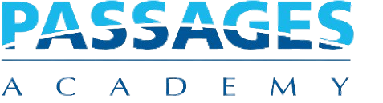

# 🎓 Passages Academy Website

A modern, responsive Next.js application for **Passages Academy**, serving students in NYC Department of Education District 79 with comprehensive educational support and resources.



## 📋 Table of Contents

- [Features](#-features)
- [Pages & Sections](#-pages--sections)
- [Campus Locations](#-campus-locations)
- [Technology Stack](#-technology-stack)
- [Setup Instructions](#-setup-instructions)
- [Project Structure](#-project-structure)
- [Deployment](#-deployment)
- [Development Team](#-development-team)
- [License & Copyright](#-license--copyright)

## ✨ Features

### 🎠 **Hero Carousel**
- Beautiful image carousel with 11 professional educational images
- Auto-rotation with 5-second intervals
- Manual navigation controls (arrows, dots, play/pause)
- Smooth fade transitions with glassmorphism effects
- Fully responsive and touch-friendly

### 🌍 **Multi-Language Support**
- Custom language selector with 10 most spoken languages in NYC DOE schools
- Google Translate integration with professional UI
- Languages supported:
  - 🇺🇸 English
  - 🇪🇸 Español (Spanish)
  - 🇨🇳 中文 (Chinese)
  - 🇸🇦 العربية (Arabic)
  - 🇧🇩 বাংলা (Bengali)
  - 🇷🇺 Русский (Russian)
  - 🇭🇹 Kreyòl (Haitian Creole)
  - 🇵🇰 اردو (Urdu)
  - 🇫🇷 Français (French)
  - 🇰🇷 한국어 (Korean)

### 🗺️ **Interactive Campus Maps**
- Google Maps integration with custom markers
- Campus location details with contact information
- "Get Directions" functionality
- Mobile-optimized map interface

### 📚 **Digital Library Platform**
- Comprehensive library resources and databases
- Student and parent sections
- Digital reading platforms (Sora, myON Reader)
- Bilingual resource highlights
- Librarian support contact forms

### 🎨 **Modern Design**
- Mobile-first responsive design
- Professional educational institution styling
- Accessible design with high contrast
- Smooth animations and transitions
- shadcn/ui component integration

## 🏫 Pages & Sections

### 🏠 **Main Academy Page**
- Dynamic hero carousel showcasing the academy
- Mission statement and NYC DOE affiliation
- Overview of specialized programs
- Interactive campus locations with Google Maps
- Contact information for all locations
- Quick navigation to library resources

### 📖 **Library Page**
- **Mission**: "Creating lifelong learners, one book at a time"
- **Digital Resources**: 
  - Sora ereading platform access
  - myON Reader integration
  - Online databases and research tools
- **Bilingual Support**: English/Spanish resources
- **Student Services**: Research assistance and tutorials
- **Parent Resources**: Family literacy programs
- **Librarian Support**: Contact forms and office hours

### 🏛️ **Library Databases Page**
- Comprehensive database collection
- Subject-specific research tools
- Academic support resources
- Citation guides and tutorials

## 📍 Campus Locations

### 🏢 **Main Campus (Horizon)**
- **Address**: 560 Brook Avenue, Bronx, NY 10455
- **Phone**: (718) 647-1800
- **Primary administrative location**

### 🏫 **Bronx Hope Campus**
- **Address**: 108 W 174th St, Bronx, NY 10453
- **Phone**: (718) 294-4832
- **Alternative education programs**

### 🏭 **Willis Avenue Location**
- **Address**: 426 Willis Ave, Bronx, NY 10454-1011
- **Specialized support services**

## 🚀 Technology Stack

### **Frontend Framework**
- **Next.js 15** - React framework with App Router
- **TypeScript** - Type-safe JavaScript development
- **React 18** - Modern React with hooks and concurrent features

### **Styling & UI**
- **Tailwind CSS** - Utility-first CSS framework
- **shadcn/ui** - Modern component library
- **Lucide React** - Professional icon set
- **CSS Custom Properties** - Advanced styling capabilities

### **Integrations**
- **Google Maps API** - Interactive campus maps
- **Google Translate** - Multilingual support
- **Next.js Image Optimization** - Performance-optimized images

### **Development Tools**
- **ESLint** - Code linting and quality
- **Prettier** - Code formatting
- **TypeScript** - Static type checking

## ⚙️ Setup Instructions

### **Prerequisites**
- Node.js 18.x or later
- npm or yarn package manager
- Google Maps API key (optional but recommended)

### **Installation**

1. **Clone the repository**
   ```bash
   git clone https://github.com/your-org/passages-academy.git
   cd passages-academy
   ```

2. **Install dependencies**
   ```bash
   npm install
   # or
   yarn install
   ```

3. **Environment Configuration**
   Create a `.env.local` file in the root directory:
   ```env
   # Google Maps API Key (Optional)
   NEXT_PUBLIC_GOOGLE_MAPS_API_KEY=your_api_key_here
   
   # Other environment variables as needed
   ```

4. **Google Maps API Setup (Optional)**
   - Visit [Google Cloud Console](https://console.cloud.google.com/)
   - Create a new project or select existing
   - Enable the following APIs:
     - Maps JavaScript API
     - Places API
     - Geocoding API
   - Create credentials and add your API key to `.env.local`

5. **Run Development Server**
   ```bash
   npm run dev
   # or
   yarn dev
   ```
   Open [http://localhost:3000](http://localhost:3000) in your browser.

6. **Build for Production**
   ```bash
   npm run build
   npm run start
   # or
   yarn build
   yarn start
   ```

### **Development Commands**
```bash
npm run dev          # Start development server
npm run build        # Build for production
npm run start        # Start production server
npm run lint         # Run ESLint
npm run type-check   # Run TypeScript checks
```

## 📁 Project Structure

```
passages-academy/
├── 📁 app/                     # Next.js App Router
│   ├── 🎨 globals.css          # Global styles and CSS variables
│   ├── 📄 layout.tsx           # Root layout with providers
│   ├── 🏠 page.tsx             # Homepage with hero and sections
│   └── 📁 library/             # Library section
│       ├── 📖 page.tsx         # Main library page
│       └── 📁 databases/       # Database resources
│           └── 📄 page.tsx     # Library databases page
├── 📁 components/              # Reusable React components
│   ├── 🎠 Hero.tsx             # Hero carousel component
│   ├── 🧭 Header.tsx           # Navigation with language selector
│   ├── 🗺️ CampusMap.tsx        # Google Maps integration
│   ├── 👇 Footer.tsx           # Site footer
│   └── 📁 library/             # Library-specific components
│       ├── 📚 LibraryHero.tsx
│       ├── 🎯 LibraryMission.tsx
│       └── 👨‍🎓 StudentsSection.tsx
├── 📁 public/                  # Static assets
│   ├── 📁 data/               # JSON data files
│   │   └── 📍 location_data.json
│   ├── 📁 images/             # Image assets
│   │   ├── 📁 hero/           # Hero carousel images (11 images)
│   │   └── 📁 logos/          # Logo assets and documentation
│   └── 🖼️ passages.png        # Main logo
├── 🔧 .gitignore              # Git ignore patterns
├── 📋 package.json            # Dependencies and scripts
├── ⚙️ next.config.js          # Next.js configuration
├── 🎨 tailwind.config.js      # Tailwind CSS configuration
├── 📝 tsconfig.json           # TypeScript configuration
└── 📖 README.md               # This documentation
```

## 🚀 Deployment

### **Recommended: Vercel**
This application is optimized for Vercel deployment:

1. Push your code to GitHub
2. Connect your repository to Vercel
3. Set environment variables in Vercel dashboard
4. Deploy automatically on every push

### **Alternative Platforms**
- **Netlify** - Static site hosting
- **GitHub Pages** - Free static hosting
- **AWS S3 + CloudFront** - Scalable hosting
- **Any static hosting service**

### **Environment Variables for Production**
```env
NEXT_PUBLIC_GOOGLE_MAPS_API_KEY=your_production_api_key
```

## 👥 Development Team

### **Lead Developers**
- **Vintesh** - Senior Developer & System Architect
- **Javier Jaramillo** - Full-Stack Developer & UI/UX Designer

### **Technical Contributions**
- Modern React/Next.js architecture
- Responsive design implementation
- Google services integration
- Multilingual support system
- Accessibility optimization
- Performance enhancement

### **Special Thanks**
- **Passages Academy Staff** - Content and requirements
- **NYC DOE District 79** - Educational guidance
- **Students and Families** - Feedback and testing

## 📞 Support

### **Technical Support**
For website technical issues or questions:
- Create an issue on GitHub
- Contact the development team

### **Educational Support**
For library and academic resources:
- Use the "Ask a Librarian" form on the website
- Contact individual campus locations
- Visit library resource pages

### **Accessibility**
This website is designed to meet WCAG 2.1 AA standards. If you encounter any accessibility issues, please contact our development team.

## 📄 License & Copyright

### **Copyright Notice**
© 2025 **Passages Academy** - NYC Department of Education, District 79  
All rights reserved.

### **Property Declaration**
This website and its contents are the intellectual property of:
- **Passages Academy**
- **NYC Department of Education, District 79**
- **New York City Public Schools**

### **Development Credits**
**Developed by**: Vintesh & Javier Jaramillo  
**Year**: 2025  
**License**: Proprietary - Educational Use

### **Usage Rights**
This software is developed specifically for Passages Academy and NYC DOE District 79. Unauthorized reproduction, distribution, or use of this code or its components is strictly prohibited without written permission from the copyright holders.

### **Educational Purpose**
This platform is designed exclusively to serve the educational mission of Passages Academy and support students, families, and staff within the NYC public school system.

---

## 📧 Contact Information

**Passages Academy**  
NYC Department of Education - District 79  
560 Brook Avenue, Bronx, NY 10455  
Phone: (718) 647-1800

**Development Team**  
For technical inquiries: [Contact via GitHub Issues]

---

*Building bridges to success, one student at a time.* 🌉📚✨